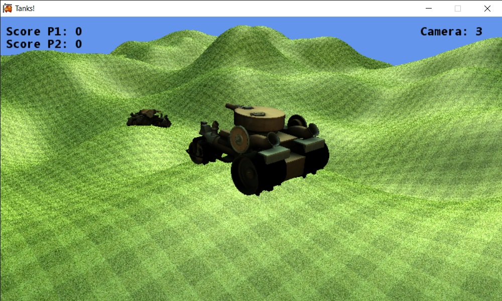
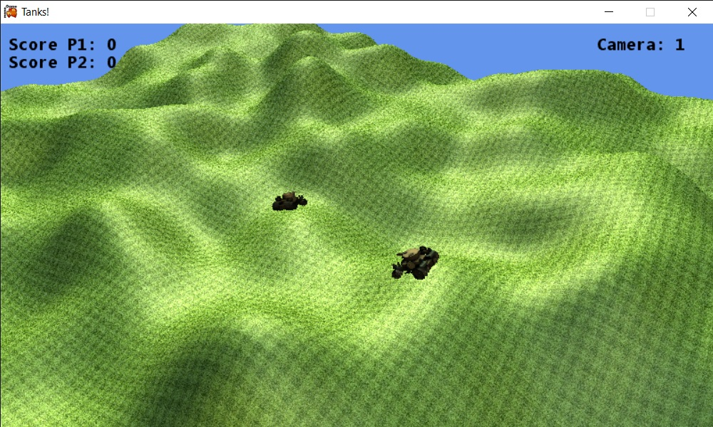
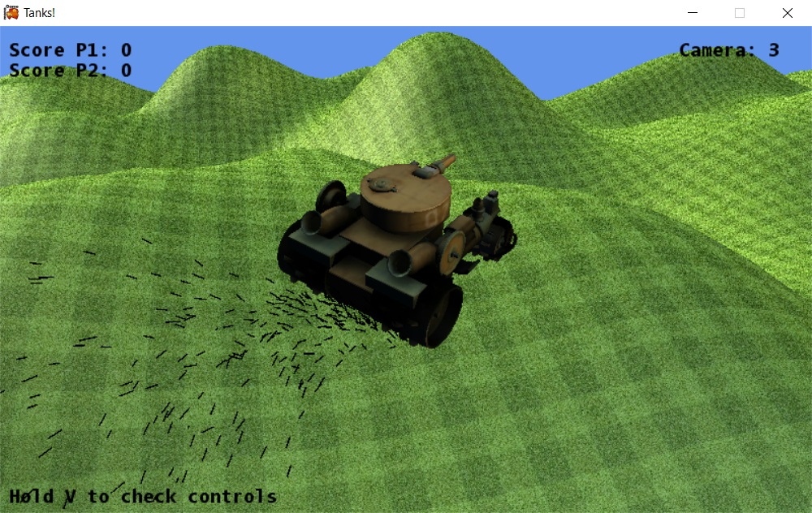
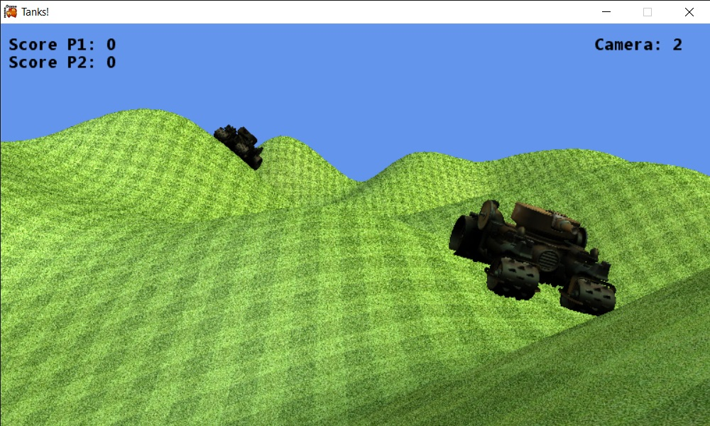

# Tanks!

A game prototype built in C# using MonoGame. We were tasked with making a 3D game that included:

- Controllable tank able to shoot projectiles
- A second tank that can be both controlled by a second player, or by AI
- Textured bumpy terrain, generated with a height map
- Lighting
- 3 different camera types
- A particle system
- Collision detection between tanks, terrain, and bullets 

# Screenshots

